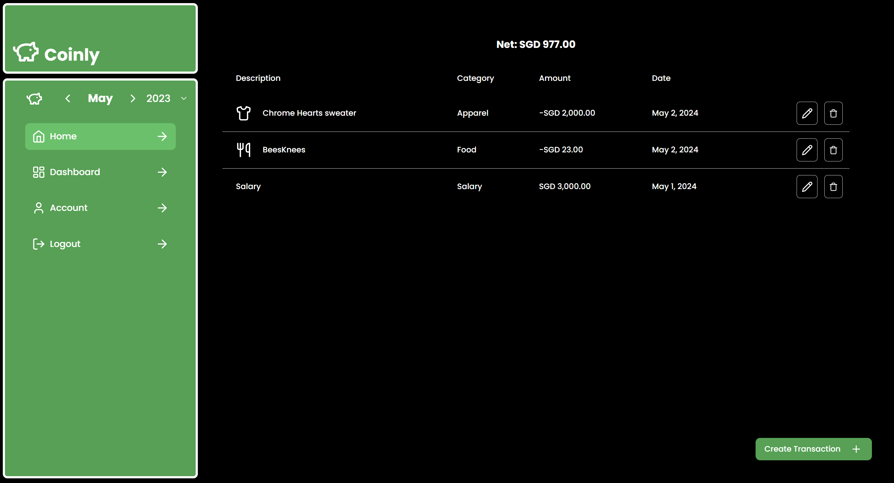

# **Coinly**
==========================

**Your Personal Spending Tracker**

Coinly is a spending tracker that allows you to record your transactions, income, and expenses, all in one place. Built with NextJS 14, TailwindCSS, and Prisma, Coinly follows best practices recommended by Vercel and is hosted on Google Cloud Platform.

## **How it works**

Coinly helps you track your spending by recording your income and expenses, providing a clear picture of your financial situation.

## **Try it out**

Visit our site at [(link unavailable)]((link unavailable)) to start tracking your spending today!

## **Features**

### Transaction Tracking

* Record your income and expenses

### Financial Overview

* Get a clear picture of your financial situation

### Easy to Use

* Simple and intuitive interface

### Secure

* Hosted on Google Cloud Platform

### CI/CD Pipeline

* Automated testing and deployment with GitHub actions

## **Screenshots**

## **What I learned**

Building Coinly taught me:

### NextJS Best Practices

* Writing good web application code

### Prisma ORM

* How to use an Object-Relational Mapper

### Testing with Jest and Cypress

* How to test web applications

### CI/CD with GitHub actions

* How to develop a continuous integration and deployment pipeline

### Deployment on Google Cloud Run

* How to deploy a NextJS application with continuous deployment

### PostgreSQL on Google Compute Engine

* How to set up a PostgreSQL database

## **Author**

*Lim Zhen Yang*

## **Tech Stack**

### Frontend

* NextJS 14
* TailwindCSS

### Backend

* Prisma
* PostgreSQL

### Deployment

* Google Cloud Platform
* Google Cloud Run
* Google Compute Engine

### Testing

* Jest
* Cypress

### CI/CD

* GitHub actions
